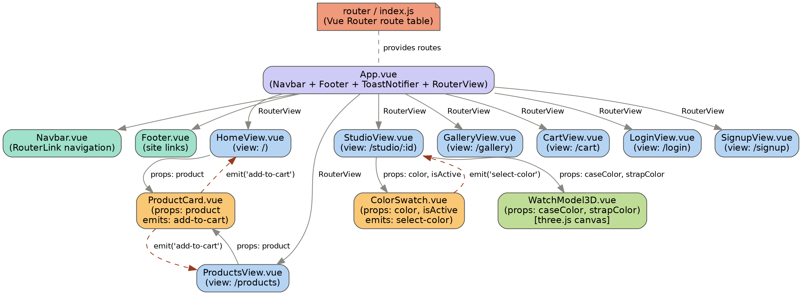
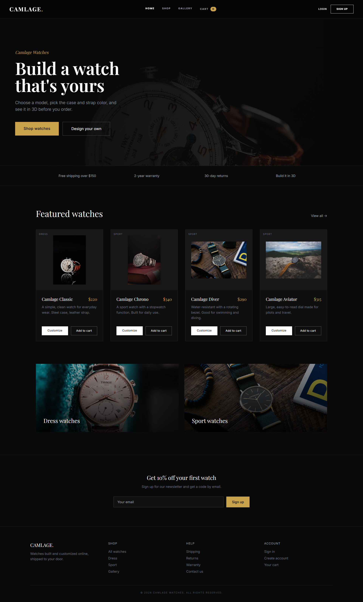
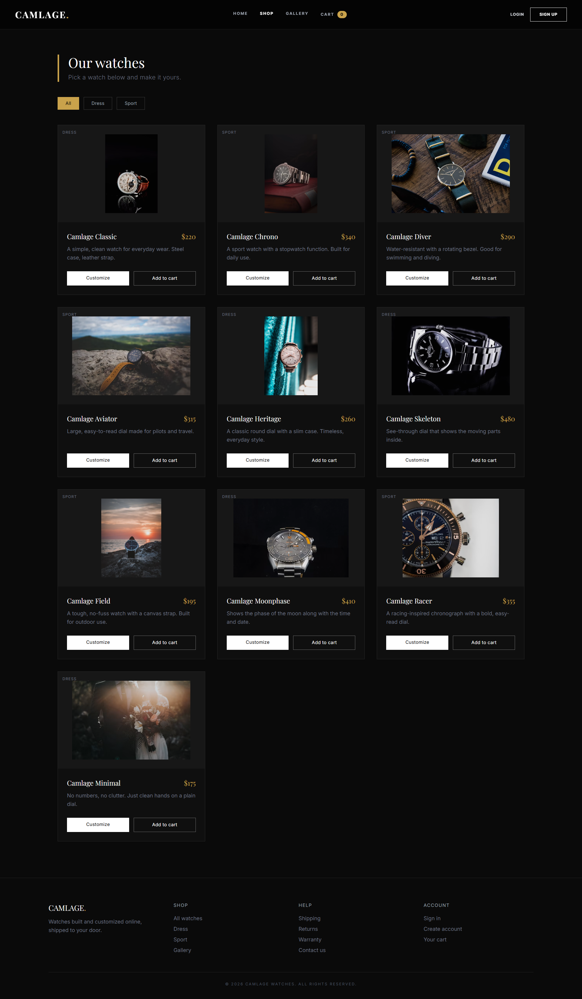
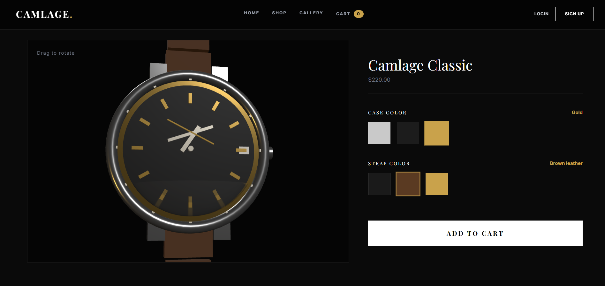
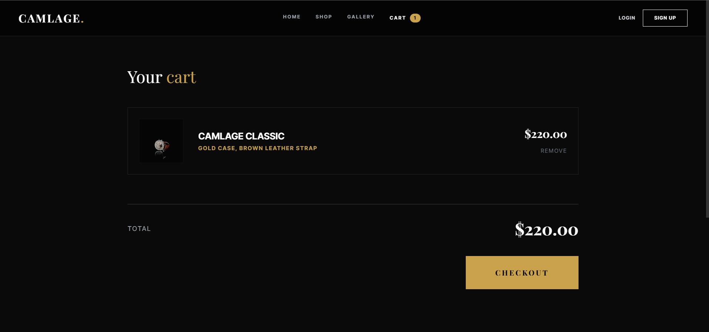

# Camlage — E-Commerce Watch Store with a 3D Configurator

**University of Sialkot — Department of Software Engineering**
**Semester Project — Deliverable 1 (Client-Side Architecture)**

| | |
|---|---|
| **Student Name** | Momna Amjad  |
| **Roll Number** | 23010101-010 |
| **Student Name** | Wajeeha Qadri  |
| **Roll Number** | 087 |
| **Instructor** | Museb Khalid |

---

## Abstract

Camlage is an e-commerce store for watches, built with the client-side
architecture required for Deliverable 1. Customers can browse a catalog of
10 watches, open any watch in a live 3D studio, change its case and strap
color, and add the customized watch to a cart. The frontend is built with
**Vue 3** and **Vite**. A backend (Express.js and a database) is planned for
a later deliverable to persist accounts, orders, and saved designs.

This deliverable demonstrates the three core Vue.js requirements of the
assignment:
1. Single Page Application (SPA) routing with Vue Router
2. Modular component architecture
3. Inter-component communication through props and custom events (emits)

---

## 1. Introduction

Camlage is proposed as an e-commerce platform for watches, where customers
can browse a catalog, open any watch in a 3D studio, change its case and
strap color, and add the customized watch to a cart. This deliverable
covers **the client-side architecture only**. Sections 2–5 below describe
the architecture, routing, component decomposition, and communication
pattern, with code drawn directly from this repository. Section 6 contains
screenshots of the running app, and Section 7 covers what comes next.

---

## 2. System Architecture Overview

The application root, `App.vue`, is a layout wrapper. It renders a
persistent `Navbar` and `Footer` around a `<router-view/>` outlet, plus a
`ToastNotifier` for short confirmation messages (e.g. "Added to cart"), so
navigation between pages swaps only the routed content while the shell
stays constant.



*Fig. 1 — Component and data-flow tree. Solid arrows denote props passed
downward; dashed arrows denote custom events (emits) bubbling upward.*

Three layers make up the app:
- **Routing layer** (`router/index.js`) — supplies the route table.
- **View layer** (`HomeView`, `ProductsView`, `StudioView`, `GalleryView`,
  `CartView`, `LoginView`, `SignupView`) — the seven navigable pages, each
  owning its own local state.
- **Component layer** (`ProductCard`, `ColorSwatch`, `WatchModel3D`) — small,
  reusable units. `WatchModel3D` wraps a `three.js` canvas that renders the
  interactive 3D watch used on the Studio page.

---

## 3. SPA Routing Implementation

Navigation is handled entirely on the client using Vue Router in HTML5
history mode, so no full page reload happens when moving between pages.

```js
// src/router/index.js
import { createRouter, createWebHistory } from 'vue-router'
import HomeView from '../views/HomeView.vue'
import ProductsView from '../views/ProductsView.vue'
import StudioView from '../views/StudioView.vue'
import GalleryView from '../views/GalleryView.vue'
import CartView from '../views/CartView.vue'
import LoginView from '../views/LoginView.vue'
import SignupView from '../views/SignupView.vue'

const router = createRouter({
  history: createWebHistory(import.meta.env.BASE_URL),
  routes: [
    { path: '/', component: HomeView },
    { path: '/products', component: ProductsView },
    { path: '/studio/:id?', component: StudioView },
    { path: '/gallery', component: GalleryView },
    { path: '/cart', component: CartView },
    { path: '/login', component: LoginView },
    { path: '/signup', component: SignupView }
  ],
  scrollBehavior() { return { top: 0 } }
})

export default router
```

The dynamic segment `/studio/:id?` lets the Studio page open for a specific
watch (e.g. `/studio/diver`) while still working with no id at all. The
layout wrapper is implemented in `App.vue`:

```html
<!-- src/App.vue -->
<template>
  <div class="min-h-screen flex flex-col">
    <Navbar />
    <ToastNotifier />
    <main class="flex-grow pt-20">
      <router-view />
    </main>
    <Footer />
  </div>
</template>
```

`<router-link>` (used inside `Navbar.vue`) drives navigation, and a single
`<router-view/>` renders whichever page matches the current URL.

---

## 4. Modular Component Architecture

The UI follows a container/presentational pattern: **views** own state and
logic, **components** are small and mostly reusable.

```
src/
├── main.js
├── App.vue
├── store.js               (shared product list + cart state)
├── router/
│   └── index.js
├── views/
│   ├── HomeView.vue        (landing page, route '/')
│   ├── ProductsView.vue    (shop page, route '/products')
│   ├── StudioView.vue      (3D configurator, route '/studio/:id')
│   ├── GalleryView.vue     (customer gallery, route '/gallery')
│   ├── CartView.vue        (shopping cart, route '/cart')
│   ├── LoginView.vue       (sign in, route '/login')
│   └── SignupView.vue      (create account, route '/signup')
└── components/
    ├── Navbar.vue
    ├── Footer.vue
    ├── ToastNotifier.vue
    ├── ProductCard.vue     (used in Home and Products)
    ├── ColorSwatch.vue     (used in Studio)
    └── WatchModel3D.vue    (three.js 3D watch, used in Studio)
```

`StudioView.vue` is the most significant page: it reads the product id from
the route, holds the currently selected case and strap color as reactive
state, and composes two children — `WatchModel3D.vue`, a real interactive
3D watch rendered with `three.js`, and `ColorSwatch.vue`, the color picker.

---

## 5. Inter-Component Communication

### A. Props — data flowing downward

`ColorSwatch.vue` is a purely presentational child. It receives a color
object and an active-state flag as props from its parent, `StudioView.vue`:

```html
<!-- src/components/ColorSwatch.vue -->
<script setup>
const props = defineProps(['color', 'isActive'])
const emit = defineEmits(['select-color'])
</script>

<template>
  <button
    @click="$emit('select-color', color)"
    class="w-14 h-14 border transition-all duration-300"
    :class="isActive ? 'border-2 border-[#c9a24b] scale-110'
                      : 'border-white/20 hover:border-white'"
    :style="{ backgroundColor: color.hex }"
    :title="color.name">
  </button>
</template>
```

### B. Emits — events flowing upward

When a swatch is clicked, it doesn't change any shared state directly —
it emits a `select-color` event carrying the chosen color. Its parent,
`StudioView.vue`, listens for that event and updates its own reactive
state, which is then passed back down as a prop to `WatchModel3D.vue` so
the 3D watch updates its material color live:

```js
// src/views/StudioView.vue (excerpt)
const activeCase = ref(caseColors[0])
const setCase = (color) => { activeCase.value = color }
```

```html
<WatchModel3D :case-color="activeCase.hex" :strap-color="activeStrap.hex" />
<ColorSwatch
  v-for="c in caseColors" :key="c.name"
  :color="c" :isActive="activeCase.name === c.name"
  @select-color="setCase"
/>
```

This is Vue's unidirectional data flow: state lives in one place
(`StudioView.vue`), and children only ever request a change through an
event. The same pattern repeats for the strap-color picker, and for
`ProductCard.vue`, whose `add-to-cart` event lets `HomeView.vue` and
`ProductsView.vue` add an item to the shared cart in `store.js` without the
card component ever touching that state directly.

---

## 6. Application Screenshots


**Home page** — hero section, featured watches, and footer
 

**Products page** — full catalog with category filter
 

**Studio page** — the interactive 3D watch with case/strap color swatches
 

**Cart page** — with at least one item added
 


## 7. Conclusion and Future Work

This deliverable establishes a complete, working client-side shell for
Camlage that satisfies all three technical requirements of the assignment:
SPA routing via Vue Router with layout wrappers (`router-view`/`router-link`),
a modular component hierarchy separating pages from reusable presentational
components, and a disciplined props-down/emits-up communication pattern. The
3D watch in `WatchModel3D.vue` is built directly with the `three.js` library,
giving the Studio page a genuine interactive preview rather than a static
image. In the next deliverable, the mock cart in `store.js` and the
sign-in/sign-up forms will be connected to a real Express REST API backed by
a database, so accounts, orders, and saved watch designs persist between
visits.

---

## Getting Started

```bash
git clone https://github.com/Momna-Amjad123/Camlage-Watches-3D-Configurator.git
cd Camlage-Watches-3D-Configurator
npm install
npm run dev
```

Then open `http://localhost:5173` in your browser.

---

## Tech Stack

- **Vue 3** (Composition API, `<script setup>`)
- **Vite** — build tool and dev server
- **Vue Router** — SPA routing
- **three.js** — real-time 3D rendering for the watch configurator
- **Tailwind CSS** (CDN) — styling

---

## References

1. Vue.js Documentation, "Introduction," 2024. https://vuejs.org/guide/introduction.html
2. Vue Router Documentation, "Getting Started," 2024. https://router.vuejs.org/guide/
3. Vite Documentation, "Why Vite," 2024. https://vitejs.dev/guide/why.html
4. three.js Documentation, "Getting Started," 2024. https://threejs.org/docs/
5. Tailwind CSS Documentation, "Installation," 2024. https://tailwindcss.com/docs/installation

---

&copy; 2026 Camlage Watches. Submitted as part of the semester project for
the Department of Software Engineering, University of Sialkot.
